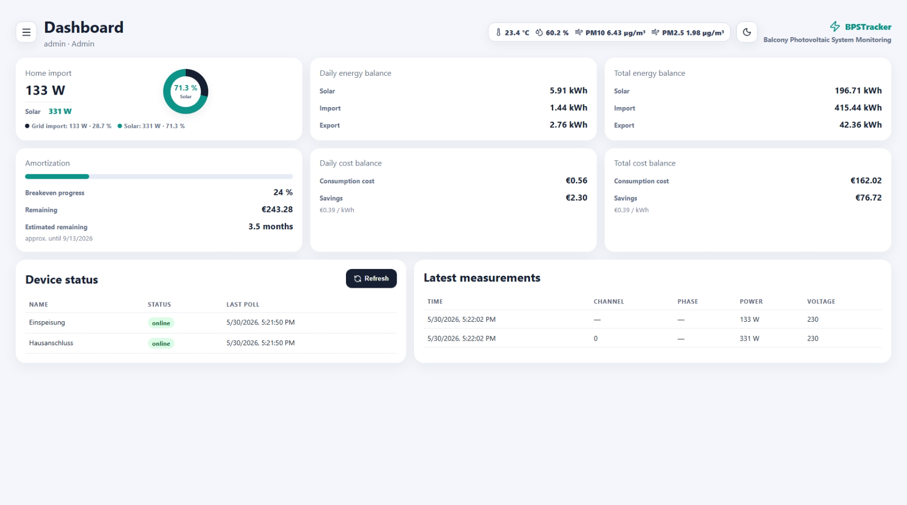

# BPSTracker

**BPSTracker** is a self-hosted monitoring dashboard for a **Balkon-Photovoltaik-System (BPS)** / balcony photovoltaic system.

It collects live power and energy values from Shelly devices, visualizes current house import and solar production, calculates daily and total balances, estimates costs and savings, and can generate a Kindle/e-ink friendly status display.

BPSTracker is designed for local home use. The backend is kept inside the Docker network and only the frontend/nginx proxy is exposed to the LAN.

Repository:

```text
https://github.com/syschelle/bpstracker
```



---

## Table of contents

- [Overview](#overview)
- [Main features](#main-features)
- [Architecture](#architecture)
- [Screens and UI](#screens-and-ui)
- [Supported devices and sensors](#supported-devices-and-sensors)
- [Authentication and user roles](#authentication-and-user-roles)
- [Kindle display](#kindle-display)
- [JSON API](#json-api)
- [Simulation mode](#simulation-mode)
- [Air quality sensor](#air-quality-sensor)
- [Data retention](#data-retention)
- [Encrypted backups](#encrypted-backups)
- [Requirements](#requirements)
- [Installation](#installation)
- [Deployment](#deployment)
- [Updating from GitHub](#updating-from-github)
- [Configuration](#configuration)
- [Ports and networking](#ports-and-networking)
- [Backup and restore](#backup-and-restore)
- [Troubleshooting](#troubleshooting)
- [Running on Raspberry Pi](#running-on-raspberry-pi)
- [Security notes](#security-notes)
- [Project structure](#project-structure)
- [License](#license)
- [Disclaimer](#disclaimer)

---

## Overview

BPSTracker is a compact local monitoring application for small photovoltaic systems, especially balcony solar installations.

The project focuses on:

- a clear dashboard
- low-maintenance Docker deployment
- local-only operation
- small-device friendly behavior
- persistent energy totals
- configurable retention for raw data
- optional Kindle/e-ink display support
- optional JSON export for external integrations

It is not intended to be a certified billing or metering system.

---

## Main features

### Dashboard

The dashboard provides a compact view of the current energy situation.

It includes:

- **House import / Hausbezug**
  - current signed grid power
  - current grid import
  - current grid export
  - current solar power
  - current total consumption estimate
  - solar/grid share gauge

- **Daily energy balance**
  - solar production
  - grid import
  - grid export

- **Total energy balance**
  - total solar production
  - total grid import
  - total grid export

- **Daily cost balance**
  - consumption costs
  - solar savings

- **Total cost balance**
  - accumulated consumption costs
  - accumulated savings

- **Amortization**
  - investment costs
  - breakeven progress
  - remaining amount
  - estimated remaining time

- **Device status**
  - online/offline state
  - last successful polling time

- **Latest measurements**
  - current normalized measurement data

Power values in the web dashboard automatically switch from watts to kilowatts when the value reaches 1000 W.

Examples:

```text
850 W
1.25 kW
-1.25 kW
```

### History

The history view displays measured power values over selectable periods.

The backend aggregates values into chart-friendly time buckets. This avoids visual spikes caused by multiple Shelly channels/phases being stored at nearly the same timestamp.

Typical ranges:

- 24 hours
- 7 days
- 30 days


### History chart series

The history chart shows separate series for:

- solar production
- grid import
- grid export

The series are color-coded so the values can be distinguished easily. Grid export is displayed as a positive value so it can be compared visually with grid import and solar production.

### Setup

The setup area allows administrators to configure:

- language
- timezone
- GitHub repository link
- Kindle display activation
- Kindle display preview
- JSON API activation
- JSON API preview
- user credentials
- financial values
- data retention
- air quality sensor
- Shelly devices
- polling intervals

### Multilingual UI

The web interface supports:

- German
- English

The selected language is stored as an application setting.

### Theme support

The frontend supports:

- light theme
- dark theme

The selected theme is stored in the browser.

### Currency support

The dashboard can display financial values in:

- EUR
- USD
- GBP

The application does not perform automatic currency conversion. The configured kWh price and investment costs are interpreted in the selected currency.

### Timezone support

The application supports IANA timezones such as:

```text
Europe/Berlin
Europe/London
UTC
America/New_York
```

Daylight saving time and winter time are handled automatically by Python `zoneinfo`.

---

## Architecture

BPSTracker consists of three main services:

```text
Frontend  -> nginx + static React build
Backend   -> FastAPI / Python
Database  -> PostgreSQL
```

The backend is not exposed directly to the outside. The browser accesses the backend only through the frontend/nginx proxy.

Typical access flow:

```text
Browser / Kindle / local integration
      |
      | HTTP
      v
Frontend container :5173
      |
      | internal Docker network
      v
Backend container :8000
      |
      | internal Docker network
      v
PostgreSQL
```

The backend remains private inside the Docker network.

---

## Screens and UI

The screenshot above shows the desktop dashboard with live energy cards, air sensor values, device status and latest measurements.


BPSTracker is optimized for desktop and mobile browsers.

The mobile header is designed to avoid crowding:

- hamburger menu on the left
- page title and role in the center
- theme toggle on the right
- air sensor values in a separate responsive row

The side navigation is detached and can be opened or closed with the hamburger button.

---

## Supported devices and sensors

BPSTracker currently focuses on Shelly devices.

Supported or intended Shelly device types include:

- Shelly 3EM Gen1
- Shelly Pro 3EM / NG 3EM
- Shelly 2PM Gen4
- generic Shelly NG devices

Each device can be configured in Setup with:

- name
- device type
- IP address or hostname
- optional username
- optional password
- polling interval
- channel
- active/inactive state

The backend normalizes measurements and stores them in PostgreSQL.

---

## Authentication and user roles

BPSTracker requires authentication.

There are two user roles:

### Admin

The admin can:

- open the dashboard
- open the history view
- open setup
- configure devices
- configure users
- configure financial settings
- configure retention
- configure language and timezone
- configure optional APIs
- manage 2FA

The admin can enable TOTP-based two-factor authentication.

### Viewer

The viewer can:

- open the dashboard
- open the history view

The viewer cannot open Setup and cannot manage 2FA.

### Password storage

Passwords are stored as secure hashes using Argon2id.

Usernames are configurable and are not required to be email addresses.

---

## Kindle display

BPSTracker can generate a Kindle/e-ink friendly PNG image.

The fixed endpoint is:

```text
http://<server-ip>:5173/api/kindle/display.png
```

Example:

```text
http://192.168.178.211:5173/api/kindle/display.png
```

The URL is intentionally fixed and does not require query parameters.

### Kindle display activation

The Kindle display can be enabled or disabled in Setup.

When disabled:

- no new Kindle PNG is generated
- the background task skips rendering
- the endpoint reports that the Kindle display is disabled

This is useful if the Kindle display is not used and the device should save resources.

### Kindle preview

Setup includes a Kindle preview button.

The preview shows the current generated PNG directly in the browser, so you can check how the image will look on the Kindle.

### Kindle image behavior

The Kindle display respects the configured UI language for date, time and update labels. German uses a 24-hour time format, while English uses an AM/PM time format.

The PNG is generated by the backend using Python and Pillow.

Properties:

- format: PNG
- size: 600 × 800 px
- grayscale-friendly design
- generated inside the container
- no external rendering tool required at runtime
- generated once per minute
- not generated exactly at second `00`
- last valid PNG is kept if rendering fails

The displayed clock is shifted by one minute to better match Kindle cron refresh timing.

### Kindle debug endpoint

A metadata endpoint is available:

```text
http://<server-ip>:5173/api/kindle/meta
```

It can be used to verify:

- whether the Kindle display is enabled
- when the last image was generated
- the renderer version
- the current image size
- possible rendering errors

### Example Kindle cron usage

A Kindle can fetch the image with a command like:

```bash
wget -O /mnt/us/bpstracker.png "http://192.168.178.211:5173/api/kindle/display.png"
```

Many older Kindle devices have problems with modern HTTPS/TLS. For local Kindle dashboards, plain HTTP inside the local network is usually the most reliable option.

---

## JSON API

BPSTracker provides an optional JSON API for external tools, scripts, home automation systems or dashboards.

Endpoint:

```text
http://<server-ip>:5173/api/current-values
```

Example:

```bash
curl http://192.168.178.211:5173/api/current-values
```

### JSON API activation

The JSON API can be enabled or disabled in Setup.

When disabled:

- `/api/current-values` does not return values
- the endpoint reports that the API is disabled

This avoids exposing integration data when the API is not needed.

### JSON API preview

Setup includes a JSON preview button.

The preview calls `/api/current-values` and displays the current JSON response directly in the browser.

### Example response

```json
{
  "timestamp_utc": "2026-05-29T20:15:00+00:00",
  "local_date": "2026-05-29",
  "timezone": "Europe/Berlin",
  "last_measurement_at": "2026-05-29T20:14:55+00:00",

  "current_solar_production_w": 120.5,
  "current_grid_power_w": 284.8,
  "current_grid_import_w": 284.8,
  "current_grid_export_w": 0.0,
  "current_total_consumption_w": 405.3,

  "daily_solar_production_kwh": 1.42,
  "daily_grid_import_kwh": 8.36,
  "daily_grid_export_kwh": 0.0,

  "total_solar_production_kwh": 15.7,
  "total_grid_import_kwh": 128.4,
  "total_grid_export_kwh": 2.1
}
```

### Field meaning

| Field | Meaning |
|---|---|
| `current_solar_production_w` | current solar production in W |
| `current_grid_power_w` | signed current grid power in W |
| `current_grid_import_w` | current grid import in W |
| `current_grid_export_w` | current grid export in W |
| `current_total_consumption_w` | estimated current total consumption in W |
| `daily_solar_production_kwh` | solar production for the current local day |
| `daily_grid_import_kwh` | grid import for the current local day |
| `daily_grid_export_kwh` | grid export for the current local day |
| `total_solar_production_kwh` | total solar production |
| `total_grid_import_kwh` | total grid import |
| `total_grid_export_kwh` | total grid export |

---

## Simulation mode

BPSTracker includes an optional simulation mode for demo or test installations without real devices.

The simulation can be enabled in:

```text
Setup -> Simulation
```

When enabled, the dashboard, history chart and JSON API return simulated values instead of real device measurements.

The simulation is based on:

- an 800 W balcony PV system
- a typical 2-person household
- realistic daily load curves
- morning and evening consumption peaks
- appliance spikes
- cloud and daylight fluctuations
- seasonal solar variation

No simulated measurements are written to the production measurement tables. The values are generated live and separated from production data. When simulation is disabled, the simulated view disappears and no demo values remain in the production environment.

The simulation also affects the Kindle display, JSON API and air sensor header. Simulated air data includes temperature, humidity, PM10 and PM2.5.

The header displays a visible simulation banner: **You are in the Matrix 😎**

This makes it possible to preview the UI, charts, balances, costs and JSON output before real Shelly devices are configured.

Disable simulation before using BPSTracker for real monitoring.

---


## Air quality sensor

BPSTracker can optionally read an air quality sensor based on the **Sensor.Community DNMS / Luftdaten** project.

More information about the supported sensor project:

```text
https://sensor.community/en/sensors/dnms/
```

BPSTracker reads the local sensor endpoint:

```text
http://<sensor-ip>/data.json
```

The expected JSON contains a `sensordatavalues` array, for example:

```json
{
  "software_version": "NRZ-2024-136-B1",
  "age": "95",
  "sensordatavalues": [
    { "value_type": "SDS_P1", "value": "1.83" },
    { "value_type": "SDS_P2", "value": "0.40" },
    { "value_type": "BME280_temperature", "value": "24.17" },
    { "value_type": "BME280_humidity", "value": "30.21" }
  ]
}
```

BPSTracker uses:

| Sensor value | Displayed as |
|---|---|
| `BME280_temperature` | Temperature |
| `BME280_humidity` | Humidity |
| `SDS_P1` | PM10 |
| `SDS_P2` | PM2.5 |

The air sensor values are not stored historically. They are shown only in the UI header and Kindle display.

### Air sensor polling behavior

The sensor is polled conservatively:

- normal successful polling interval: 180 seconds
- retry interval after failure: 30 seconds
- short HTTP timeouts
- last valid values are kept if the sensor is temporarily unavailable

This prevents a slow or unreachable sensor from blocking the BPSTracker application.

---

## Data retention

To prevent the database from growing indefinitely, BPSTracker supports raw data retention.

Raw measurements are deleted after the configured number of days.

Daily aggregates are kept permanently and are used for:

- total energy balance
- total cost balance
- amortization
- long-term totals

This keeps the database small while preserving important long-term values.

---

## Requirements

### Recommended system

- Linux host
- Docker
- Docker Compose plugin
- persistent storage below `/opt/bpstracker`

Recommended hardware:

- Raspberry Pi 3, 4 or 5
- small home server
- mini PC
- NAS with Docker support

### Minimum system

A Raspberry Pi Zero 2 may work, but it is close to the limit because it only has 512 MB RAM.

For low-memory systems:

- avoid building Docker images on the device
- use prebuilt images if possible
- enable swap
- keep polling intervals reasonable
- keep raw retention short
- disable unused features such as Kindle display or JSON API

---

## Installation

Clone the repository:

```bash
git clone https://github.com/syschelle/bpstracker.git
cd bpstracker
```

Create or review the environment file:

```bash
cp .env.example .env
nano .env
```

Deploy the application:

```bash
bash ./deploy.sh
```

The deployment is designed to install and run the application below:

```text
/opt/bpstracker
```

---

## Deployment

After deployment, open the frontend in your browser:

```text
http://<server-ip>:5173
```

Example:

```text
http://192.168.178.211:5173
```

The frontend listens on port `5173`.

The backend is only reachable inside the Docker network and should not be exposed directly.

---

## Updating from GitHub

If you installed the project from GitHub:

```bash
cd /opt/bpstracker
git pull
bash ./deploy.sh
```

The deployment script should rebuild or restart the required services.

After updating, reload the browser page.

For frontend changes, a hard reload may be required:

```text
Ctrl + F5
```

On mobile browsers, closing and reopening the browser tab or clearing the site cache may be necessary.

---

## Configuration

Most settings are configured in the web interface under **Setup**.

### Language

Supported languages:

- German
- English

### Timezone

Use a valid IANA timezone, for example:

```text
Europe/Berlin
```

This automatically handles daylight saving time and winter time.

### GitHub repository

Setup contains a direct link to the project repository:

```text
https://github.com/syschelle/bpstracker
```

### Currency

Supported currencies:

- EUR
- USD
- GBP

No automatic currency conversion is performed.

### Financial settings

Configure:

- kWh price
- investment costs

These values are used to calculate:

- consumption costs
- solar savings
- amortization progress

### Optional interfaces

Setup allows enabling or disabling:

- Kindle display generation
- JSON API

Both features include preview/test buttons.

### Devices

Each Shelly device can be configured with:

- host/IP
- type
- channel
- polling interval
- optional credentials
- active/inactive state

### Users

The setup area allows changing:

- admin username
- admin password
- viewer username
- viewer password

The viewer has no setup access.

---

## Ports and networking

Default external port:

```text
5173
```

The browser, Kindle and local integrations should use:

```text
http://<server-ip>:5173
```

Important endpoints:

```text
/api/auth/login
/api/measurements/summary
/api/current-values
/api/settings/air-sensor/current
/api/kindle/display.png
/api/kindle/meta
```

The backend itself should not be published to the host network.

---

---

## Encrypted backups

BPSTracker can create encrypted backups directly from the **Setup** area.

The backup feature is intended to protect the most important application data without exposing secrets in plain text. The backup password is entered **per backup** and is **not stored** anywhere.

The password is not saved in:

- the database
- `.env`
- application settings
- the backup metadata
- the browser after the form is cleared

The backend only uses the password in memory while creating the encrypted backup.

### What is included

A backup contains:

```text
backup/
├── manifest.json
├── database.sql
├── environment.env
└── backend_data/
```

The most important part is the PostgreSQL dump:

```text
database.sql
```

It contains the BPSTracker database state, including:

- application settings
- configured devices
- users and password hashes
- 2FA configuration
- historical measurements
- daily aggregates
- financial settings
- optional interface settings

The `environment.env` file contains an environment snapshot that can help with restore or migration.

The `backend_data/` directory may contain backend-side data such as cached generated files. The backup directory itself is excluded from nested backups.

### Backup filename

Encrypted backup files use this naming scheme:

```text
bpstracker-backup-YYYYMMDD-HHMMSS.tar.gz.bpsenc
```

Example:

```text
bpstracker-backup-20260530-143012.tar.gz.bpsenc
```

### Encryption

Backups are encrypted before download.

The current format uses:

```text
AES-256-GCM
PBKDF2-HMAC-SHA256
per-backup random salt
per-backup random nonce
```

The unencrypted intermediate archive is deleted immediately after encryption.

### Creating a backup

Open the web interface as an admin user and go to:

```text
Setup -> Backup
```

Then:

1. Enter a backup password.
2. Repeat the password.
3. Click **Create encrypted backup**.
4. Download the generated `.tar.gz.bpsenc` file.
5. Store the file and password safely.

The password must be at least 12 characters long.

### Existing backups

The Setup page lists existing encrypted backups stored on the server.

For each backup you can:

- download it again
- delete it from the server

Only admin users can create, download or delete backups.

### Important warning

The backup password cannot be recovered.

If the password is lost, the backup cannot be decrypted.

This is intentional and protects the backup if the file is copied or leaked.

### Restore

Automatic restore from the web UI is intentionally not implemented yet.

Restoring a backup replaces the running application's own database and should be done manually and carefully.

A manual restore flow is expected to look like this:

1. Stop BPSTracker.
2. Decrypt the `.tar.gz.bpsenc` backup using the backup password.
3. Extract the resulting archive.
4. Restore `database.sql` into PostgreSQL.
5. Restore configuration/data files as needed.
6. Start BPSTracker again.

A dedicated restore guide should be added before using backups for production disaster recovery.

---


## Reset measured values

Admins can reset all measured values from the **Setup** area.

The reset requires typing:

```text
reset
```

This deletes:

- raw measurements
- daily energy aggregates
- volatile air sensor caches
- volatile simulation caches
- generated Kindle cache files

It keeps:

- users
- passwords and 2FA configuration
- configured devices
- financial settings
- language/timezone settings
- optional interface settings

This action cannot be undone. Create an encrypted backup before using it in production.

---


## Backup and restore

For encrypted backups created from the web interface, see [Encrypted backups](#encrypted-backups). These backups are password-protected and should be preferred over unencrypted manual archive backups.


The most important data is stored in the Docker volumes and persistent data directory below:

```text
/opt/bpstracker
```

Recommended backup items:

- PostgreSQL data volume
- `.env`
- application data directory
- optional generated Kindle PNG cache

Simple backup approach:

```bash
tar -czf bpstracker-backup.tar.gz /opt/bpstracker
```

For a database-consistent backup, use PostgreSQL tools such as `pg_dump`.

---

## Troubleshooting

### Frontend cannot login and shows `Failed to fetch`

Make sure the browser calls the same origin:

```text
http://<server-ip>:5173/api/auth/login
```

It should not call:

```text
http://localhost:8000/api/auth/login
```

The backend is intentionally not exposed directly.

### 502 Bad Gateway

A 502 usually means the frontend/nginx proxy cannot reach the backend container.

Check container status:

```bash
docker compose ps
```

Check backend logs:

```bash
docker compose logs backend --tail=100
```

### Backend healthcheck fails

Check backend logs:

```bash
docker compose logs backend --tail=200
```

Common causes:

- database not ready
- migration problem
- invalid environment variable
- Python import error
- missing dependency

### NPM install hangs

The project is intended to ship with a built frontend `dist` for low-power devices.

On small systems such as a Raspberry Pi Zero 2, avoid running npm builds locally.

### Kindle image does not update

Check whether the Kindle display is enabled in Setup.

Then check:

```text
http://<server-ip>:5173/api/kindle/meta
```

The PNG is generated once per minute and may not change instantly.

### JSON API does not return values

Check whether the JSON API is enabled in Setup.

Then test:

```bash
curl http://<server-ip>:5173/api/current-values
```

### Air sensor values are stale

The air sensor is intentionally polled only every 180 seconds after successful reads.

If the sensor is offline, BPSTracker keeps the last valid values.

---

## Running on Raspberry Pi

### Raspberry Pi Zero 2

The Pi Zero 2 can potentially run BPSTracker, but it is not ideal.

Limitations:

- only 512 MB RAM
- PostgreSQL can be memory-heavy
- Docker builds are slow
- npm builds should be avoided

Recommended:

- use 64-bit Raspberry Pi OS
- enable at least 1 GB swap
- avoid building images on the Pi
- keep retention short
- use reasonable polling intervals
- disable unused optional features

Check architecture:

```bash
uname -m
```

Recommended output:

```text
aarch64
```

### Raspberry Pi 3/4/5

A Raspberry Pi 3 or newer is recommended for continuous operation.

A Raspberry Pi 4 or 5 provides a much better experience.

---

---

## Prebuilt Docker images

BPSTracker can be built automatically by GitHub Actions for multiple architectures and published to GitHub Container Registry.

The repository includes the workflow:

```text
.github/workflows/docker-images.yml
```

It builds:

```text
ghcr.io/syschelle/bpstracker-backend:latest
ghcr.io/syschelle/bpstracker-frontend:latest
```

Supported platforms:

```text
linux/amd64
linux/arm64
```

This is useful for Raspberry Pi systems or small servers because they no longer need to build Python or frontend images locally.

To deploy using prebuilt images:

```bash
cd /opt/bpstracker
git pull
bash ./deploy-images.sh
```

See also:

```text
docs/ghcr-images.md
```

## Security notes

BPSTracker is intended for local network use.

Recommendations:

- do not expose the application directly to the internet
- keep the backend private inside Docker
- use strong admin and viewer passwords
- enable admin 2FA
- access remotely only through VPN or another trusted private network
- enable optional APIs only when they are needed

The Kindle endpoint and JSON API are designed for simple local access and should not be exposed publicly.

---

## Project structure

Typical structure:

```text
bpstracker/
├── backend/
│   └── app/
│       ├── main.py
│       ├── kindle_display.py
│       ├── routers/
│       ├── models.py
│       ├── schemas.py
│       └── ...
├── frontend/
│   ├── src/
│   ├── public/
│   ├── dist/
│   └── nginx.conf
├── scripts/
├── docker-compose.yml
├── deploy.sh
├── .env.example
├── README.md
└── LICENSE
```

---

## Development notes

The frontend is a React/Vite application.

The backend is a FastAPI application.

For local development, run the services separately or through Docker Compose.

The production deployment uses the built frontend `dist` and nginx.

---

## License

This project is licensed under the **Apache License, Version 2.0**.

You may obtain a copy of the license at:

```text
https://www.apache.org/licenses/LICENSE-2.0
```

Unless required by applicable law or agreed to in writing, software distributed under the Apache License, Version 2.0 is distributed on an "AS IS" BASIS, WITHOUT WARRANTIES OR CONDITIONS OF ANY KIND, either express or implied.

---

## Disclaimer

BPSTracker is a private monitoring tool for local energy visualization. It is not a certified metering system and should not be used for billing, legal metering, or safety-critical decisions.


<!-- Fix simulation banner rendering by keeping App as the default React export. -->
