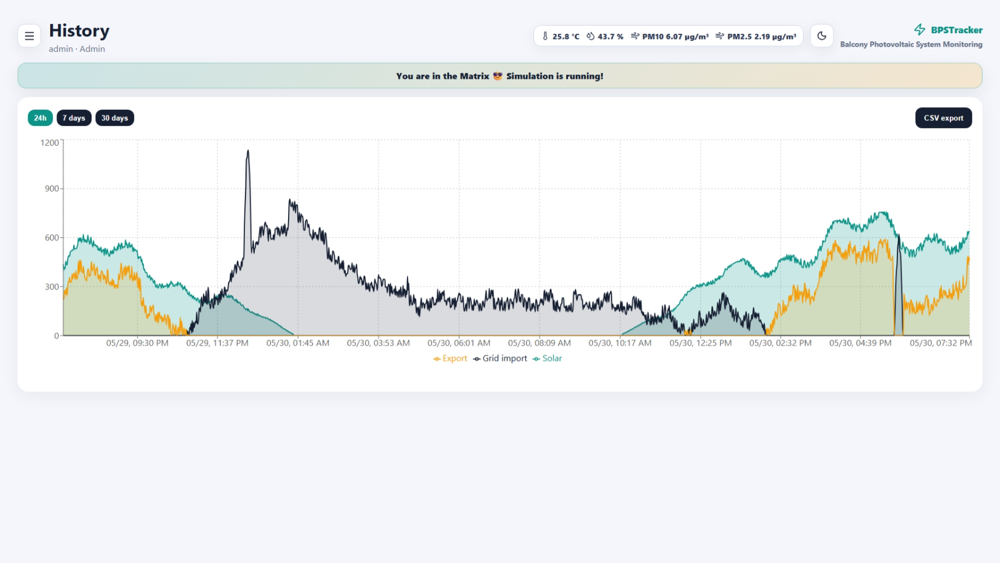
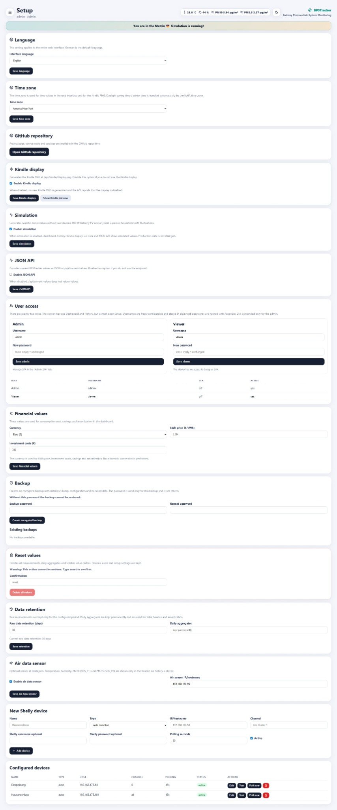
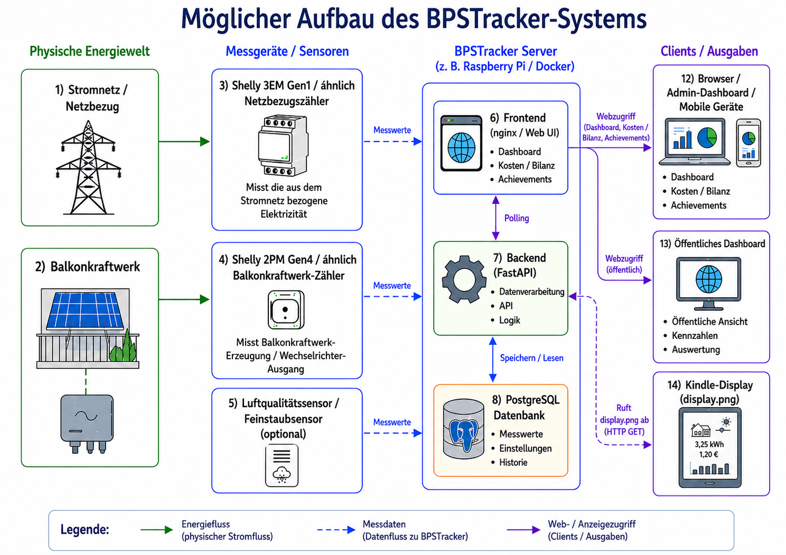

# BPSTracker

**BPSTracker** ist eine selbst gehostete Webanwendung zur Überwachung eines Balkon-Photovoltaik-Systems. Die Anwendung erfasst Leistungs- und Energiewerte von Shelly-Geräten, bereitet diese in einem responsiven Dashboard auf und stellt optionale Zusatzfunktionen wie Kindle-Anzeige, Luftdaten, JSON-API, Simulation, verschlüsselte Backups und Akku-Amortisationsberechnung bereit.

Das Projekt ist für den lokalen Betrieb im Heimnetz gedacht. Backend und Datenbank laufen innerhalb des Docker-Netzwerks; nach außen wird nur die Weboberfläche bereitgestellt.

---

## Inhaltsverzeichnis

- [Screenshots](#screenshots)
- [Hauptfunktionen](#hauptfunktionen)
- [Architektur](#architektur)
- [Systemvoraussetzungen](#systemvoraussetzungen)
- [Geräte-Zweck](#geräte-zweck)
- [Unterstützte Geräte](#unterstützte-geräte)
- [Installation mit Docker](#installation-mit-docker)
- [Betrieb mit vorgebauten Docker-Images](#betrieb-mit-vorgebauten-docker-images)
- [Setup in der Weboberfläche](#setup-in-der-weboberfläche)
- [Dashboard](#dashboard)
- [Historie](#historie)
- [Simulation](#simulation)
- [Kindle-Display](#kindle-display)
- [Öffentliches Dashboard](#öffentliches-dashboard)
- [JSON-API](#json-api)
- [Luftdatensensor](#luftdatensensor)
- [Amortisations-Achievements](#amortisations-achievements)
- [Akku-Amortisationsberechnung](#akku-amortisationsberechnung)
- [Verschlüsselte Backups](#verschlüsselte-backups)
- [Werte zurücksetzen](#werte-zurücksetzen)
- [Datenaufbewahrung](#datenaufbewahrung)
- [Raspberry Pi Hinweise](#raspberry-pi-hinweise)
- [Updates](#updates)
- [Sicherheit](#sicherheit)
- [Lizenz](#lizenz)

---

## Screenshots

### Dashboard-Übersicht


### Historie mit Simulationsmodus



### Setup-Übersicht




---

## Hauptfunktionen

- Überwachung von Balkon-PV-Erzeugung und Haus-/Netzbezug
- Unterstützung für Shelly-Geräte
- responsives Web-Dashboard
- helle und dunkle Darstellung mit gespeicherter Theme-Auswahl
- Tagesbilanz und Gesamtbilanz
- Kosten- und Einsparungsübersicht
- Amortisationsanzeige für das Balkonkraftwerk
- optionale Akku-Amortisationsberechnung
- optionale Simulation für Demo- und Testbetrieb
- optionale Luftdatenanzeige im Header
- optionale Kindle-kompatible PNG-Anzeige
- optionale JSON-API für aktuelle Werte
- optionales öffentliches Dashboard ohne Login
- verschlüsselte Admin-Backups
- Reset-Funktion für Messwerte
- Docker-Deployment
- Multi-Arch-Docker-Images für `linux/amd64` und `linux/arm64`

---

## Systemvoraussetzungen

BPSTracker ist für den selbst gehosteten Betrieb als Docker-Anwendung gedacht.

Mindestvoraussetzungen:

- Linux-Host mit Docker Engine
- Docker Compose Plugin
- Git zum Klonen und Aktualisieren des Repositorys
- 64-Bit-Betriebssystem
- Netzwerkzugriff vom BPSTracker-Host auf die konfigurierten Shelly-Geräte
- moderner Browser für die Weboberfläche

Empfohlene Hardware:

- Raspberry Pi 3 / 4 / 5 mit 64-Bit-Betriebssystem
- Raspberry Pi Zero 2 W mit 64-Bit-Betriebssystem für kleinere Installationen
- x86_64 Mini-PC, NAS oder Server
- mindestens 1 GB RAM
- persistenter Speicher für PostgreSQL-Daten und Backups

Unterstützte Container-Plattformen:

```text
linux/amd64
linux/arm64
```

Raspberry-Pi-Prüfung:

```bash
uname -m
```

Empfohlenes Ergebnis:

```text
aarch64
```

Für Raspberry-Pi-Systeme wird ein 64-Bit-Betriebssystem empfohlen, damit die `linux/arm64` Images verwendet werden können.

Benötigte Netzwerkports:

```text
5173  Weboberfläche / Frontend
5432  PostgreSQL, nur internes Docker-Netzwerk
8000  Backend-API, nur internes Docker-Netzwerk
```

Nur der Frontend-Port muss im lokalen Netzwerk erreichbar sein. Backend und Datenbank sollten im Docker-Netzwerk bleiben.

---

## Architektur

Das folgende Schema zeigt einen möglichen BPSTracker-Aufbau mit getrenntem Netzbezug und separat gemessener Balkonsolar-Erzeugung:



BPSTracker besteht aus mehreren Komponenten:

```text
frontend/   React/Vite-Weboberfläche
backend/    FastAPI-Backend
postgres    PostgreSQL-Datenbank
nginx       statische Auslieferung und API-Proxy im Frontend-Container
```

Typischer Betrieb:

```text
Browser / Kindle / API-Client
        |
        v
Frontend / nginx Host-Port :5173 → Container :8080
        |
        v
Backend / FastAPI :8000
        |
        v
PostgreSQL
```

---

## Geräte-Zweck

Jedes Shelly-Gerät kann im Setup einen Zweck bekommen:

```text
Automatisch erkennen
Hausbezug / Netz
Solar / Einspeisung
Verbraucher / Sonstiges
Ignorieren
```

Damit können auch mehrere Solar-/Einspeisegeräte sauber konfiguriert werden. Geräte mit dem Zweck **Solar / Einspeisung** werden für Dashboard, Historie, JSON-API und Kindle-Display summiert.

Verhalten:

- **Hausbezug / Netz**: wird als Haus-/Netzzähler verwendet
- **Solar / Einspeisung**: wird als Solarproduktion / Einspeisung gewertet
- **Verbraucher / Sonstiges**: bleibt als Messwert sichtbar, wird aber nicht als Hauptquelle für Netz oder Solar gezählt
- **Ignorieren**: wird aus berechneten Dashboard-Werten ausgeschlossen
- **Automatisch erkennen**: nutzt das bisherige Verhalten anhand der Shelly-Messquelle

Negative Leistungswerte bei Solar-/Einspeisegeräten werden für berechnete Werte als positive Solarproduktion gewertet.

---

## Unterstützte Geräte

BPSTracker ist auf Shelly-basierte Messungen ausgelegt.

Typische Geräte:

- Shelly 3EM Gen1
- Shelly Pro 3EM Gen2
- Shelly 2PM Gen4
- generische Shelly-NG-Geräte

Die Anwendung unterscheidet zwischen Netz-/Hausbezug und Solarerzeugung. Für die Solarproduktion wird typischerweise ein Shelly-Schalt-/Messkanal am Wechselrichter oder der PV-Einspeisung verwendet.

---

## Installation mit Docker

Repository klonen:

```bash
git clone https://github.com/syschelle/bpstracker.git
cd bpstracker
```

Konfiguration anlegen:

```bash
cp .env.example .env
```

Danach `.env` anpassen.

Start mit lokalem Build:

```bash
bash ./deploy.sh
```

Bei einer frischen Datenbank öffnet sich in der Weboberfläche zuerst die Ersteinrichtung. Dort legt der erste Anwender den Admin-Benutzernamen und das Admin-Passwort fest. In `.env` werden keine Admin- oder Viewer-Zugangsdaten ausgeliefert. Vor Produktivbetrieb müssen `POSTGRES_PASSWORD`, `DATABASE_URL` und `SECRET_KEY` auf starke Werte gesetzt werden; Docker Compose verweigert den Start, wenn erforderliche Secrets fehlen.

Die Weboberfläche ist anschließend erreichbar unter:

```text
http://<ip-adresse>:5173
```

---

## Betrieb mit vorgebauten Docker-Images

BPSTracker kann über GitHub Actions als Multi-Arch-Docker-Image gebaut werden.

Verwendete Images:

```text
ghcr.io/syschelle/bpstracker-backend:latest
ghcr.io/syschelle/bpstracker-frontend:latest
```

Unterstützte Plattformen:

```text
linux/amd64
linux/arm64
```

Betrieb mit vorgebauten Images:

```bash
docker compose -f docker-compose.images.yml pull
docker compose -f docker-compose.images.yml up -d
```

Oder mit Script:

```bash
bash ./deploy-images.sh
```

Für einen festen Release-Stand kann in `.env` gesetzt werden:

```env
BPSTRACKER_IMAGE_TAG=v0.3.1
```

Dann wird genau dieser Release verwendet.

---

## Setup in der Weboberfläche

Im Setup können unter anderem konfiguriert werden:

- Sprache
- Zeitzone
- GitHub-Repository-Link
- Kindle-Display
- Simulation
- JSON-API
- Admin-Zugang und optionaler Viewer-Zugang
- Finanzwerte
- Akku-Amortisationsberechnung
- verschlüsselte Backups
- Werte-Reset
- Datenaufbewahrung
- Luftdatensensor
- Geräte

Die Sprache im Setup ist die serverseitige Standardsprache. Sie wird unter anderem für serverseitig erzeugte Ausgaben wie das Kindle-Display verwendet. Zusätzlich gibt es im Header einen EN/DE-Umschalter, der nur die Browser-Sprache per Cookie ändert.

Die Zeitzone wird als IANA-Zeitzone gespeichert, zum Beispiel:

```text
Europe/Berlin
```

Sommerzeit und Winterzeit werden dadurch automatisch berücksichtigt.

---

## Dashboard

Das Dashboard zeigt unter anderem:

- aktuellen Netz-/Hausbezug
- aktuelle Solarproduktion
- Tagesbilanz
- Gesamtbilanz
- Tageskostenbilanz
- Gesamtkostenbilanz
- Amortisation
- Akku-Bewertung, falls aktiviert
- zusammengeführter Gerätestatus mit aktuellen Messwerten
- automatisch ausgeblendete optionale Messwertspalten, wenn sie nicht konfiguriert oder nicht vorhanden sind
- Luftdaten im Header, falls aktiviert
- Simulationshinweis, falls der Demo-Modus aktiv ist

In der Kachel **Hausbezug / Home import** wird der Wert farblich markiert:

```text
negativ  → rot
0 W      → grün
positiv  → Standard-Textfarbe
```

Bei aktivierter Simulation wird im Header angezeigt:

```text
Du bist in der Matrix 😎 Simulation läuft!
```

---

## Historie

Die Historie zeigt Messwerte als Zeitreihe.

Die Darstellung enthält getrennte Kurven für:

- Solarproduktion
- Netzbezug
- Einspeisung

Die Werte sind farblich getrennt, damit sie leichter unterschieden werden können. Solar ist grün, Netzbezug blau und Einspeisung rot. Einspeisung wird positiv dargestellt, um sie im Diagramm besser mit Solar und Netzbezug vergleichen zu können.

---

## Simulation

Der Simulationsmodus kann im Setup aktiviert werden.

Er simuliert:

- eine 800-Watt-Balkon-PV-Anlage
- einen typischen 2-Personen-Haushalt
- realistische Tagesverläufe
- Morgen- und Abendspitzen
- Haushaltsgeräte-Spikes
- Grundlast
- Wolken- und Erzeugungsschwankungen
- saisonale Solarvariation

Die Simulation betrifft:

- Dashboard
- Historie
- aktuelle Messwerte
- JSON-API
- Kindle-Display
- Luftdatenanzeige

Die Simulation schreibt keine produktiven Messwerte in die Messwerttabellen. Wenn die Simulation deaktiviert wird, verschwinden die simulierten Werte wieder aus der Anzeige.

Im Simulationsmodus werden auch konfigurierte Geräte anhand ihres Zwecks simuliert. So können Geräte im Setup geplant werden, obwohl sie physisch noch nicht vorhanden sind. Mehrere Geräte mit dem Zweck **Solar / Einspeisung** werden simuliert, aufgeteilt und für die berechneten Anzeigen summiert.

---

## Kindle-Display

BPSTracker kann ein Kindle-kompatibles PNG erzeugen:

```text
http://<ip-adresse>:5173/api/kindle/display.png
```

Die Datei wird im Hintergrund erzeugt und kann regelmäßig vom Kindle abgeholt werden. `display.png` bleibt bewusst als optional öffentlicher Cache-Endpunkt verfügbar, weil viele Kindle-/E-Ink-Abrufe keine Auth-Cookies oder Bearer-Token mitsenden können. Metadaten und manuelles Refresh sind davon getrennt und nur für Admins erreichbar. Seit v0.7.7 liegt die automatisch erzeugte PNG standardmäßig unter `/tmp/bpstracker-kindle-display.png`, weil sie nur ein regenerierbarer Cache ist. Das verhindert stehende Bilder, wenn ältere Installationen nach dem Container-Hardening noch ein root-owned Backend-Datenverzeichnis haben.

Angezeigt werden unter anderem:

- Uhrzeit
- Datum
- Temperatur
- Luftfeuchte
- PM10
- PM2.5
- Hausbezug
- Solarwert
- Tageskosten und Einsparung

Die Sprache für das Kindle-Display kommt aus der gespeicherten Setup-Sprache. Der Header-Umschalter ändert nur die Sprache des aktuellen Browsers per Cookie.


### Kindle-Bild aktualisiert sich nicht

Prüfe zuerst im Setup, ob das Kindle-Display aktiviert ist. Die PNG wird einmal pro Minute im Hintergrund erzeugt und ändert sich nicht sekundengenau.

Die Metadaten sind nur für Admins sichtbar:

```text
http://<ip-adresse>:5173/api/kindle/meta
```

Wenn Du `KINDLE_OUTPUT_PATH=/app/data/kindle-display.png` gesetzt hast, muss das Backend-Datenverzeichnis für den non-root Backend-User beschreibbar sein:

```bash
sudo chown -R 10001:10001 /opt/bpstracker/data/backend
docker compose up -d --force-recreate backend
```

Bei Renderfehlern steht im Backend-Log ab v0.7.7 die Meldung `Failed to generate Kindle display PNG` inklusive Ursache.

Das Kindle-Display berücksichtigt die eingestellte Sprache:

Deutsch:

```text
30.05.2026
14:05
Aktualisiert: 14:05:12
```

Englisch:

```text
05/30/2026
2:05 PM
Updated: 2:05:12 PM
```

---

## Öffentliches Dashboard

BPSTracker kann optional eine separate öffentliche Dashboard-Seite bereitstellen, die ohne Login erreichbar ist.

Die Funktion kann im Setup aktiviert werden:

```text
Setup → Öffentliches Dashboard
```

Wenn sie aktiviert ist, ist die öffentliche Seite erreichbar unter:

```text
/public/dashboard
```

Beispiel:

```text
http://<ip-adresse>:5173/public/dashboard
```

Die öffentliche Seite zeigt:

- Dashboard-Kacheln mit aggregierten Energiewerten
- aktuelle Luftsensorwerte, falls der Luftsensor eingerichtet ist

Sie zeigt **nicht**:

- Gerätestatus
- aktuelle Einzelmesswerte
- Setup
- Historie
- Account / 2FA
- Benutzerverwaltung
- Backups
- Reset-Funktionen
- Admin-Funktionen

Die öffentlichen Backend-Endpunkte liefern nur die für diese Seite nötigen aggregierten Werte, wenn die Freigabe im Setup aktiv ist. Ist die Freigabe deaktiviert, ist das öffentliche Dashboard nicht verfügbar.

Aktiviere diese Funktion nur, wenn diese Werte für Besucher in deinem Netzwerk oder über deinen Reverse Proxy sichtbar sein dürfen.

---

## JSON-API

Die JSON-API kann im Setup aktiviert oder deaktiviert werden.

Sie stellt aktuelle Werte bereit, zum Beispiel:

- aktuelle Solarproduktion
- aktueller Netzbezug
- aktueller Gesamtverbrauch
- Tagesproduktion Solar
- Tagesbezug
- Tageseinspeisung
- Gesamtproduktion
- Gesamteinspeisung

Die API ist nützlich für externe Systeme, Smart-Home-Integrationen oder eigene Skripte.

---

## Luftdatensensor

Optional kann ein Luftdatensensor aus dem Sensor.Community-Umfeld eingebunden werden.

Projektlink:

```text
https://sensor.community/en/sensors/dnms/
```

Der Sensor liefert Daten über:

```text
http://<sensor-ip>/data.json
```

BPSTracker verwendet daraus:

- Temperatur
- Luftfeuchte
- PM10
- PM2.5

Der Sensor wird nicht historisch gespeichert. Die Werte werden nur aktuell im Webinterface und optional im Kindle-Display angezeigt.

Wenn der Sensor nicht antwortet, blockiert er die App nicht. Es werden Timeouts verwendet, und bei Fehlern bleibt der letzte bekannte Wert erhalten.

---

## Amortisations-Achievements

BPSTracker zeigt kleine, spielerische Achievements im Header, sobald die gesamte Solar-Ersparnis bestimmte Schwellen erreicht.

Beispiele:

```text
Erster Sonnenstrom
Kaffee-Kasse geladen
Pizza-Power
Kino-Abend
Solar-Legende
```

Das erste Achievement wird freigeschaltet, sobald erstmals Solarproduktion erkannt wurde. Die weiteren Achievements basieren auf der gesamten Ersparnis (`savings_total_eur`). Sie werden lokal im Browser gespeichert und bleiben nach dem Freischalten sieben Tage sichtbar. Jedes Achievement hat zusätzlich ein kleines lokales SVG-Badge, das im Header angezeigt wird. Die Texte sind mehrsprachig auf Deutsch und Englisch verfügbar. Die Achievements sind nur eine motivierende Anzeige und verändern die eigentliche Amortisations- oder Finanzberechnung nicht.

---

## Akku-Amortisationsberechnung

Die Akku-Amortisationsberechnung ist optional und kann im Setup aktiviert oder deaktiviert werden.

Im Setup können eingetragen werden:

```text
Akku-Kosten
Akku-Kapazität in kWh
```

Die Berechnung basiert auf dem Überschuss, der sonst eingespeist würde.

Wichtig: Einspeisung wird mit `0` vergütet. Der mögliche Nutzen eines Akkus entsteht daher nur dadurch, dass eingespeister Überschuss später Netzbezug ersetzen könnte.

Annahmen:

- Einspeisung wird nicht vergütet
- Akku-Wirkungsgrad: 90 %
- maximal ein Lade-/Entladezyklus pro Tag
- nutzbarer Tagesüberschuss wird durch die Akku-Kapazität begrenzt
- wenn das Balkonkraftwerk noch nicht amortisiert ist, wird die offene Rest-Amortisation mit berücksichtigt

Die Anzeige unterscheidet zwischen:

- reiner Akku-Amortisation
- offenen Restkosten des Balkonkraftwerks
- kombinierter Betrachtung aus Restkosten + Akku-Kosten

Wenn die Akku-Berechnung deaktiviert ist, bleiben die eingegebenen Werte gespeichert, werden aber nicht im Dashboard berechnet oder angezeigt.

---

## Verschlüsselte Backups

Im Setup können verschlüsselte Backups erstellt werden.

Ablauf:

1. Passwort eingeben
2. Passwort wiederholen
3. verschlüsseltes Backup erstellen
4. Backup herunterladen

Das Passwort wird nicht gespeichert.

Nicht gespeichert in:

- Datenbank
- `.env`
- App-Einstellungen
- Backup-Metadaten

Backup-Dateien haben die Endung:

```text
.tar.gz.bpsenc
```

Ein Backup enthält unter anderem:

```text
backup/
├── manifest.json
├── database.sql
├── environment.env
└── backend_data/
```

Wichtig: Ohne Passwort kann das Backup nicht wiederhergestellt werden.

---

## Werte zurücksetzen

Admins können Messwerte im Setup zurücksetzen.

Dazu muss der Text eingegeben werden:

```text
reset
```

Gelöscht werden:

- Messwerte
- Tagesaggregate
- flüchtige Luftdaten-Caches
- flüchtige Simulations-Caches
- generierte Kindle-Cache-Dateien

Erhalten bleiben:

- Benutzer
- Passwörter und 2FA
- Geräte
- Setup-Einstellungen
- Finanzwerte
- Sprache und Zeitzone

Diese Aktion kann nicht rückgängig gemacht werden.

---

## Datenaufbewahrung

Rohmesswerte können zeitlich begrenzt gespeichert werden.

Tagesaggregate bleiben dauerhaft erhalten und werden für Langzeitwerte, Gesamtbilanz und Amortisation verwendet.

Dadurch kann die Datenbank klein bleiben, ohne Langzeit-Auswertungen zu verlieren.

---

## Raspberry Pi Hinweise

Für Raspberry Pi 3/4/5 oder Raspberry Pi Zero 2 wird ein 64-Bit-Betriebssystem empfohlen.

Prüfen:

```bash
uname -m
```

Empfohlen:

```text
aarch64
```

Dann können die `linux/arm64` Docker-Images verwendet werden.

---

## Updates

Mit vorgebauten Images:

```bash
cd /opt/bpstracker
git pull
docker compose -f docker-compose.images.yml pull
docker compose -f docker-compose.images.yml up -d
```

Oder:

```bash
bash ./deploy-images.sh
```

Mit lokalem Build:

```bash
cd /opt/bpstracker
git pull
bash ./deploy.sh
```

---

## Sicherheit

Empfehlungen:

- `.env` niemals in GitHub hochladen
- den initialen Admin nur über die Ersteinrichtung beim ersten Start anlegen
- starke Passwörter verwenden
- 2FA aktivieren
- den HttpOnly-Cookie-Auth-Modus beibehalten und keine Browser-Token-Speicherung in `localStorage` wieder einführen
- bei reinem HTTPS-Betrieb `AUTH_COOKIE_SECURE=true` setzen
- Shelly- und Luftdaten-Hosts nur als LAN-Host/IP konfigurieren; öffentliche, Loopback- und Metadata-IP-Adressen werden blockiert
- fehlgeschlagene Login- und 2FA-Versuche werden serverseitig begrenzt
- Container-Hardening aktiviert lassen: non-root Backend/Frontend, read-only Dateisysteme, gedroppte Linux-Capabilities und `no-new-privileges`
- Backend- und Datenbank-Port nicht veröffentlichen; Browser-Zugriffe über den nginx-Same-Origin-Proxy `/api/` führen
- regelmäßige verschlüsselte Backups erstellen
- Backup-Passwort sicher verwahren
- öffentliche Exponierung nur über Reverse Proxy mit HTTPS
- GitHub Container Registry Images bevorzugt mit festen Release-Tags verwenden

Die Anmeldung verwendet standardmäßig ein HttpOnly-Cookie `bpstracker_access_token`. Das Frontend speichert den JWT nicht mehr in `localStorage`; alte `bpstracker-token`-Einträge aus Versionen vor v0.7.3 werden beim Laden der UI gelöscht. Cross-Origin-Entwicklungsumgebungen müssen explizite `FRONTEND_ORIGIN`-Werte setzen, weil credentialed Wildcard-CORS absichtlich deaktiviert bleibt.

Die SHA-256-Passwortmigration und die Migration alter Klartext-TOTP-Secrets bleiben nur noch für das v0.7-Migrationsfenster erhalten. Betreiber sollten alle Benutzer einmal anmelden lassen, damit Passwörter auf Argon2id aktualisiert werden, und 2FA neu einrichten, falls noch ein alter Klartext-TOTP-Wert genutzt wird. Beide Kompatibilitätspfade sind für ein späteres Security-Release zur Entfernung vorgesehen.

---

## Lizenz

Dieses Projekt steht unter der **Apache License Version 2.0**.

Siehe:

```text
LICENSE
```

---

## Repository

```text
https://github.com/syschelle/bpstracker
```


<!-- Version: Die angezeigte App-Version wird in `frontend/package.json` gepflegt. -->


<!-- API: Öffentliche Gerätestatus- und Einzelmesswerte-Endpunkte entfernt; öffentliches Dashboard nutzt nur aggregierte Übersicht und Luftsensorwerte. -->


### v0.7.4 Frontend-Healthcheck-Hotfix

Der Frontend-Container nutzt das unprivileged-nginx-Image und lauscht im Container auf Port `8080`. Die URL am Host bleibt unverändert, zum Beispiel `http://<server-ip>:5173`, weil Docker `${FRONTEND_PORT:-5173}` auf den Container-Port `8080` abbildet.

Nach einem Upgrade von einem Image vor v0.7.3 muss der Frontend-Container neu erstellt werden; ein bloßer Restart reicht nicht zuverlässig. Sonst kann noch ein alter Container auf Port `80` lauschen, während die gehärtete Compose-Datei bereits auf `8080` mapped:

```bash
docker compose up -d --build --force-recreate frontend
docker compose ps
curl -fsS "http://127.0.0.1:${FRONTEND_PORT:-5173}/health"
```

v0.7.5 stellt wieder einen expliziten HTTP-Healthcheck gegen den gehärteten internen nginx-Port `8080` her, damit der Containerstatus den tatsächlich ausgelieferten `/health`-Endpunkt prüft.


### v0.7.5 Frontend-Port-Mapping-Fix

Dieses Release macht den bestätigten v0.7.3/v0.7.4-Deployment-Fix in beiden Compose-Dateien und den Deployment-Skripten eindeutig: Der Host-Port bleibt über `${FRONTEND_PORT:-5173}` konfigurierbar, muss aber auf den internen nginx-Port `8080` des Frontend-Containers zeigen.

Richtiges Mapping:

```yaml
ports:
  - "${FRONTEND_PORT:-5173}:8080"
```

Altes falsches Mapping:

```yaml
ports:
  - "${FRONTEND_PORT:-5173}:80"
```

Der Frontend-Healthcheck prüft jetzt `http://127.0.0.1:8080/health` im Container. `deploy-images.sh` erstellt Container mit `--force-recreate --remove-orphans` neu, damit alte `5173:80`-Mappings bei Image-Deployments entfernt werden.

Upgrade-Prüfung auf dem Server:

```bash
docker compose ps
docker port bpstracker-frontend
curl -fsS "http://127.0.0.1:${FRONTEND_PORT:-5173}/health"
```

Die Port-Ausgabe soll `8080/tcp -> 0.0.0.0:5173` enthalten, nicht `80/tcp -> 0.0.0.0:5173`.


### v0.7.8 Dashboard-Geräteansicht bereinigt

v0.7.8 führt die bisherigen Dashboard-Kacheln **Gerätestatus** und **Aktuelle Messwerte** zu einer kompakten Tabelle zusammen. Die Tabelle blendet optionale Spalten wie Kanal, Phase, Spannung und Strom automatisch aus, wenn sie nicht konfiguriert sind oder in den aktuellen Messwerten nicht vorkommen.

### v0.7.10 Dashboard-Messwerte nach Device-Setup filtern

v0.7.10 behält die zusammengeführte Dashboard-Tabelle für Gerätestatus und aktuelle Messwerte bei, filtert die angezeigten Messwertzeilen aber nach der im Setup gespeicherten Shelly-Konfiguration. Wenn für ein Gerät ein bestimmter Kanal gesetzt ist, werden nur Messwerte dieses Kanals angezeigt und in aktuellen Dashboard-Werten berücksichtigt. Shelly 3EM Gen1-Geräte ohne gesetzten Kanal zeigen weiterhin L1, L2, L3 und Gesamt; bei gesetztem Gen1-Phasenkanal wird nur die ausgewählte Phase angezeigt und die nicht konfigurierte Gesamtzeile ausgeblendet.

### v0.7.9 Mehrzeilige Dashboard-Messwerte

v0.7.9 behält die zusammengeführte Dashboard-Tabelle bei, zeigt aber wieder eine aktuelle Messwertzeile pro Gerät/Quelle/Kanal/Phase. Mehrphasige Shelly-Geräte wie der Shelly 3EM Gen1 zeigen dadurch wieder L1, L2, L3 und Gesamt, während optionale Spalten wie Kanal ausgeblendet bleiben, wenn sie für die dargestellten Daten nicht aussagekräftig sind.

### v0.7.6 Dashboard-Bilanzen und Shelly-Autoerkennung

v0.7.6 behebt zwei Regressionen nach Neuinstallationen und den letzten Hardening-Schritten. Die Tages-/Gesamtenergie und Kostenbilanzen im Dashboard berücksichtigen jetzt Shelly-Netzbezugs-Energiezähler auch dann, wenn das Gerät noch auf automatischer Zweck-Erkennung steht. Außerdem wird bei erfolgreicher Shelly-Autoerkennung der erkannte Gerätetyp gespeichert, damit neu angelegte oder erfolgreich gepollte Geräte nicht dauerhaft auf `auto` bleiben.

### v0.7.12 Achievement-Badge im Header als Tooltip

v0.7.12 hält den Header kompakter: Im Header wird nur noch das Achievement-Badge angezeigt. Der lokalisierte Achievement-Text erscheint beim Hover über das Badge und wird zusätzlich als Accessibility-Label gesetzt. Die Anzeige folgt dabei der aktiven Sprachwahl Deutsch/Englisch.

### v0.7.11 Achievement-Fortschritt überarbeitet

v0.7.11 überarbeitet die Dashboard-Achievements. Ein neues GoLive-Badge wird vergeben, sobald die System-Summary erfolgreich geladen wurde. Das Badge „Erster Sonnenstrom“ wird erst vergeben, wenn das konfigurierte Balkonkraftwerk tatsächlich Solarenergie produziert hat (`solar_total_kwh > 0`). Die Ersparnis-Badges bleiben bis 120 Währungseinheiten erhalten; danach werden weitere Achievements über den Amortisationsfortschritt bei 25 %, 50 %, 75 % und 100 % ausgelöst, nicht mehr über die reine Geldersparnis. Der englische Text für den ersten Sonnenstrom entspricht jetzt sinngemäß der deutschen Stromimperium-Formulierung.


### v0.7.13 README-Architekturbild

v0.7.13 ergänzt die README-Dateien um das BPSTracker-Systemschema. Das Bild zeigt den typischen Aufbau mit getrenntem Netzbezug, separat gemessener Balkonsolar-Erzeugung, Shelly-Messgeräten, BPSTracker-Server, Browser-/Mobile-Clients, öffentlichem Dashboard und Kindle-Abruf von `display.png`.
